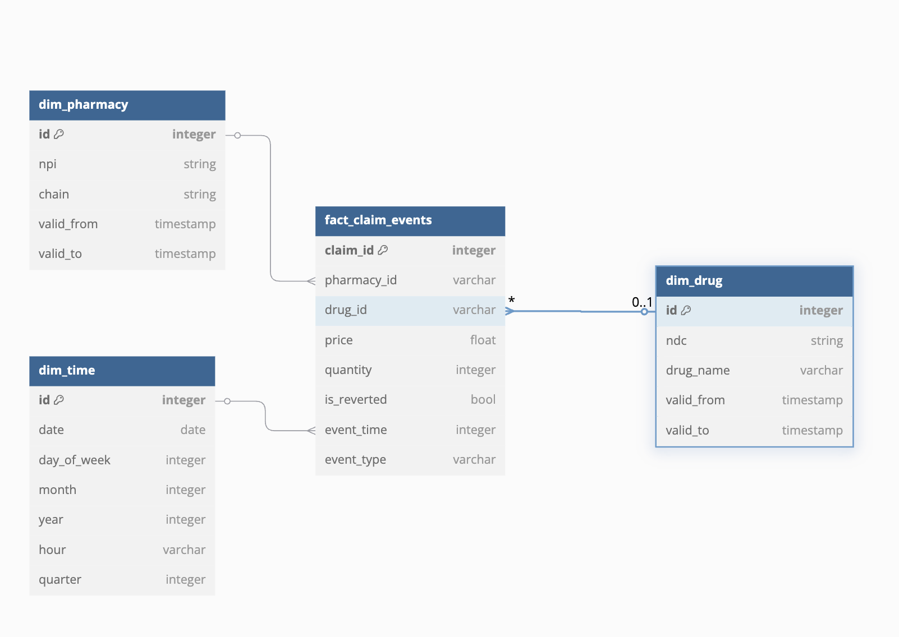

# Data Processor Application

A Python application for processing, validating, and analyzing healthcare-related data (pharmacies, claims, and rollbacks). It handles CSV/JSON files, validates records, and generates analytical insights.

## Table of Contents
- [Installation](#installation)
- [Usage](#usage)
- [Functionality](#functionality)
  - [Data Processing](#data-processing)
  - [Analysis](#analysis)
- [File Structure](#file-structure)
- [Logging](#logging)
- [Requirements](#requirements)
- [Future Improvements](#future-improvements)

---

## Installation

1. **Clone the repository**:
   ```bash
   git clone <repository-url>
   ```

2. **Navigate to the project directory**:
   ```bash
   cd data-processor
   ```

3. **Install dependencies**:
   ```bash
   pip install -r requirements.txt
   ```

---

## Usage

### Running the Application
Execute the main script to process data and generate insights:
```bash
python data_processor.py
```

This performs:
- Loading/validation of datasets (CSV/JSON).
- Processing data and saving results to output files.
- Executing analyses to generate insights.

### Example Script Workflow
1. **Initialize the Data Processor**:
   ```python
   base_path = os.path.join(os.getcwd(), "data")
   processor = DataProcessor(base_path)
   ```

2. **Process Datasets**:
   - Load and validate pharmacy, claims, and rollback data.
   - Invalid records are saved to `invalid_records/`.

3. **Perform Analyses**:
   - **Top Prescribed Quantities**: Most common drug quantities per product.
   - **Top Chains**: Pharmacy chains prescribing the highest-priced drugs.
   - **General Analysis**: Merges claims/rollbacks to calculate metrics like total fills and average price.

---

## Functionality

### Data Processing
- **Loading & Validation**:
  - Loads CSV/JSON files and checks for required columns (e.g., `pharmacy_id`, `claim_id`).
  - Invalid rows are flagged and saved to `invalid_records/`.

- **Folder Processing**:
  - Processes all files in a directory (e.g., `pharmacies/`, `claims/`).

- **Data Saving**:
  - Saves valid/invalid data to appropriate formats (CSV/JSON).

### Analysis
- **General Analysis**:
  - Merges claims and rollbacks data.
  - Calculates metrics: total fills, reverted claims, average price, and total price.

- **Top Prescribed Quantities**:
  - Identifies top 4 prescribed quantities for each drug product.

- **Top Chains**:
  - Ranks top 2 pharmacy chains per drug based on highest prices.

---

## File Structure
```
data/
├── pharmacies/       # Pharmacy data (CSV)
├── claims/           # Claims data (JSON)
├── reverts/          # Rollback data (JSON)
├── invalid_records/  # Invalid data (CSV/JSON)
logs/                 # Application logs
results/              # Analysis outputs (CSV/JSON)
```

---

## Logging
- Logs are stored in `logs/` with timestamps (e.g., `2023-10-01_12-30-45.log`).
- Tracks data loading, validation errors, analysis steps, and warnings.

---

## Requirements
- Python 3.x
- Pandas (see `requirements.txt` for full dependencies)

---

## Future Improvements
- Add advanced data validation rules (e.g., data type checks).
- Implement parallel processing for large datasets.
- Expand reporting capabilities (e.g., PDF/Excel reports).
- Enhance error handling for edge cases.

## Star Schema



## Code

https://dbdiagram.io/d

```sql
Table dim_pharmacy {
  id integer [primary key]  // Surrogate Key
  npi string [unique]       // Pharmacy NPI (Natural Key)
  chain string             // Pharmacy Chain Name
  valid_from timestamp 
  valid_to timestamp
}


Table dim_drug {
  id integer [primary key]  // Surrogate Key
  ndc string [unique]       // National Drug Code (Natural Key)
  drug_name varchar 
  valid_from timestamp
  valid_to timestamp
}


Table dim_time {
  id integer [primary key]  // Surrogate Key
  date date
  day_of_week integer
  month integer
  year integer
  hour varchar
  quarter integer
}

TABLE (Merged Claims & Reverts)
Table fact_claim_events {
  claim_id integer [primary key]
  pharmacy_id varchar
  drug_id varchar
  price float
  quantity integer
  is_reverted bool
  event_time integer // FK to dim_time
  event_type varchar // 'CLAIMED' or 'REVERTED'
}


// RELATIONSHIPS
Ref: fact_claim_events.pharmacy_id > dim_pharmacy.id
Ref: fact_claim_events.drug_id > dim_drug.id
Ref: fact_claim_events.event_time > dim_time.id
```

### Loading the data into the DW using staging tables and type 2 SCD

Schema Overview with Staging

Staging Tables (stg_pharmacy, stg_claims, stg_reverts): Temporary holding tables for raw data

Dimension Tables (dim_pharmacy, dim_drug, dim_time): Slowly Changing Dimension Type 2 (SCD2)

Fact Table (fact_claim_events): Stores event-based transactional data

a. Load data into staging tables
```sql
-- Load Pharmacy Data into Staging
TRUNCATE TABLE stg_pharmacy;
INSERT INTO stg_pharmacy (id, chain)
SELECT DISTINCT id, chain FROM pharmacy_schema;

-- Load Claims Data into Staging
TRUNCATE TABLE stg_claims;
INSERT INTO stg_claims (id, npi, ndc, price, quantity, timestamp)
SELECT id, npi, ndc, price, quantity, timestamp FROM claims_event_schema;

-- Load Reverts Data into Staging
TRUNCATE TABLE stg_reverts;
INSERT INTO stg_reverts (id, claim_id, timestamp)
SELECT id, claim_id, timestamp FROM revert_event_schema;
```
Truncating staging tables first will ensure the staging table always hold the latest data

b. Transform & Load Dimensions (Slowly Changing Dimension Type 2)

```sql
-- Load into dim_pharmacy (SCD Type 2: Insert new, Update expired)
INSERT INTO dim_pharmacy (npi, chain, valid_from, valid_to)
SELECT s.npi, s.chain, CURRENT_TIMESTAMP, NULL
FROM stg_pharmacy s
LEFT JOIN dim_pharmacy d ON s.npi = d.npi
WHERE d.npi IS NULL; -- Insert only new records

UPDATE dim_pharmacy
SET valid_to = CURRENT_TIMESTAMP
WHERE npi IN (SELECT npi FROM stg_pharmacy) AND valid_to IS NULL;
```
Type 2 SCD in this case is useful as it inserts new records while marking existing records as expired (valid_to is updated).

c. Populate dim_drug dimension
```sql
-- Load into dim_drug (SCD Type 2)
INSERT INTO dim_drug (ndc, drug_name, valid_from, valid_to)
SELECT s.ndc, 'Unknown Drug', CURRENT_TIMESTAMP, NULL
FROM stg_claims s
LEFT JOIN dim_drug d ON s.ndc = d.ndc
WHERE d.ndc IS NULL;

UPDATE dim_drug
SET valid_to = CURRENT_TIMESTAMP
WHERE ndc IN (SELECT ndc FROM stg_claims) AND valid_to IS NULL;
```
Drug names might be missing initially, requiring an enrichment process later.

d. Populate dim_time table

```sql
-- Load into dim_time (Ensuring unique time records)
INSERT INTO dim_time (date, day_of_week, month, year, hour, quarter)
SELECT DISTINCT
    DATE(timestamp) AS date,
    EXTRACT(DOW FROM timestamp) AS day_of_week,
    EXTRACT(MONTH FROM timestamp) AS month,
    EXTRACT(YEAR FROM timestamp) AS year,
    TO_CHAR(timestamp, 'HH24') AS hour,
    EXTRACT(QUARTER FROM timestamp) AS quarter
FROM stg_claims
ON CONFLICT (date, hour) DO NOTHING; -- Avoid duplicate inserts
```
e. Load data into fact_claims_events
```sql
-- Insert claims into fact_claim_events
INSERT INTO fact_claim_events (claim_id, pharmacy_id, drug_id, price, quantity, is_reverted, event_time, event_type)
SELECT 
    c.id AS claim_id,
    p.id AS pharmacy_id,
    d.id AS drug_id,
    c.price,
    c.quantity,
    FALSE AS is_reverted,
    t.id AS event_time,
    'CLAIMED' AS event_type
FROM stg_claims c
JOIN dim_pharmacy p ON c.npi = p.npi
JOIN dim_drug d ON c.ndc = d.ndc
JOIN dim_time t ON DATE(c.timestamp) = t.date AND TO_CHAR(c.timestamp, 'HH24') = t.hour;
```

```sql
-- Insert reverts into fact_claim_events
INSERT INTO fact_claim_events (claim_id, pharmacy_id, drug_id, price, quantity, is_reverted, event_time, event_type)
SELECT 
    r.claim_id AS claim_id,
    fc.pharmacy_id,
    fc.drug_id,
    fc.price,
    fc.quantity,
    TRUE AS is_reverted,
    t.id AS event_time,
    'REVERTED' AS event_type
FROM stg_reverts r
JOIN fact_claim_events fc ON r.claim_id = fc.claim_id
JOIN dim_time t ON DATE(r.timestamp) = t.date AND TO_CHAR(r.timestamp, 'HH24') = t.hour;
```

### Queries

1. Get the total quantity of claimed drugs for a specific pharmacy within a given time period:
```sql
SELECT
    p.chain AS pharmacy_chain,
    d.drug_name,
    SUM(f.quantity) AS total_claimed_quantity
FROM
    fact_claim_events f
JOIN
    dim_pharmacy p ON f.pharmacy_id = p.id
JOIN
    dim_drug d ON f.drug_id = d.id
JOIN
    dim_time t ON f.event_time = t.id
WHERE
    f.event_type = 'CLAIMED'
    AND p.npi = 'PHARMACY_NPI'  -- Replace with the actual NPI
    AND t.date BETWEEN '2023-01-01' AND '2023-12-31'  -- Adjust date range
GROUP BY
    p.chain, d.drug_name
ORDER BY
    total_claimed_quantity DESC;
```

2. Get a list of pharmacies and the drugs they have claimed, including whether the claim was reverted
```sql
SELECT
    p.chain AS pharmacy_chain,
    d.drug_name,
    f.is_reverted,
    COUNT(f.claim_id) AS total_claims
FROM
    fact_claim_events f
JOIN
    dim_pharmacy p ON f.pharmacy_id = p.id
JOIN
    dim_drug d ON f.drug_id = d.id
WHERE
    f.event_type = 'CLAIMED'  -- or 'REVERTED' if required
GROUP BY
    p.chain, d.drug_name, f.is_reverted
ORDER BY
    total_claims DESC;
```

3. Get the total amount of money claimed for each drug within a specific time period:
```sql
SELECT
    d.drug_name,
    SUM(f.price * f.quantity) AS total_claimed_amount
FROM
    fact_claim_events f
JOIN
    dim_drug d ON f.drug_id = d.id
JOIN
    dim_time t ON f.event_time = t.id
WHERE
    f.event_type = 'CLAIMED'
    AND t.date BETWEEN '2023-01-01' AND '2023-12-31'  -- Adjust date range
GROUP BY
    d.drug_name
ORDER BY
    total_claimed_amount DESC;
```

4. Get the count of reverted claims by pharmacy and drug:
```sql
SELECT
    p.chain AS pharmacy_chain,
    d.drug_name,
    COUNT(f.claim_id) AS total_reverted_claims
FROM
    fact_claim_events f
JOIN
    dim_pharmacy p ON f.pharmacy_id = p.id
JOIN
    dim_drug d ON f.drug_id = d.id
WHERE
    f.event_type = 'REVERTED'
GROUP BY
    p.chain, d.drug_name
ORDER BY
    total_reverted_claims DESC;
```

5. Identify the most claimed drugs in a specific year, including their total claimed quantity and amount:
```sql
SELECT
    d.drug_name,
    SUM(f.quantity) AS total_claimed_quantity,
    SUM(f.price * f.quantity) AS total_claimed_amount
FROM
    fact_claim_events f
JOIN
    dim_drug d ON f.drug_id = d.id
JOIN
    dim_time t ON f.event_time = t.id
WHERE
    f.event_type = 'CLAIMED'
    AND t.year = 2023  -- Adjust the year as needed
GROUP BY
    d.drug_name
ORDER BY
    total_claimed_quantity DESC;
```
6. Get the total quantity claimed by each pharmacy, for each drug, along with the drug's price:
```sql
SELECT
    p.chain AS pharmacy_chain,
    d.drug_name,
    SUM(f.quantity) AS total_claimed_quantity,
    AVG(f.price) AS avg_claimed_price
FROM
    fact_claim_events f
JOIN
    dim_pharmacy p ON f.pharmacy_id = p.id
JOIN
    dim_drug d ON f.drug_id = d.id
WHERE
    f.event_type = 'CLAIMED'
GROUP BY
    p.chain, d.drug_name
ORDER BY
    total_claimed_quantity DESC;
```

7. Get the total claims for a specific drug within a specific time period (e.g., within a specific quarter of the year):
```sql
SELECT
    d.drug_name,
    SUM(f.quantity) AS total_claimed_quantity,
    SUM(f.price * f.quantity) AS total_claimed_amount
FROM
    fact_claim_events f
JOIN
    dim_drug d ON f.drug_id = d.id
JOIN
    dim_time t ON f.event_time = t.id
WHERE
    f.event_type = 'CLAIMED'
    AND t.quarter = 2  -- Replace with the desired quarter (e.g., 1, 2, 3, 4)
    AND t.year = 2023  -- Adjust the year as needed
GROUP BY
    d.drug_name
ORDER BY
    total_claimed_quantity DESC;
```